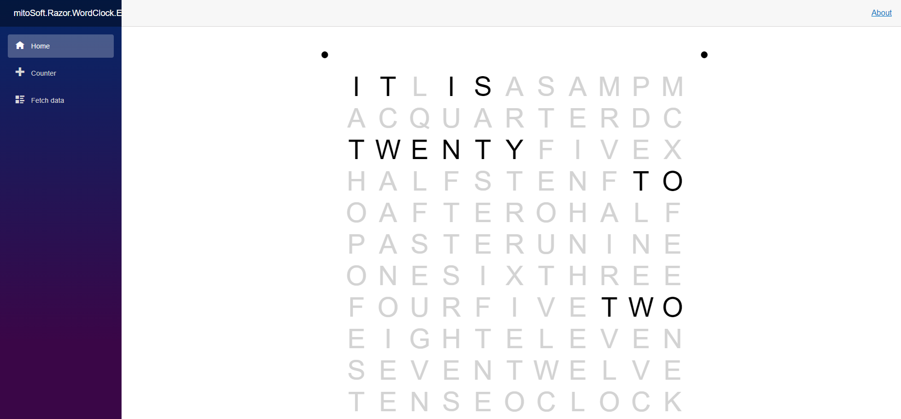
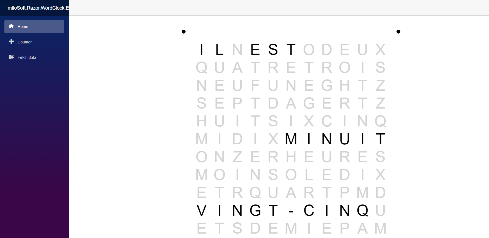
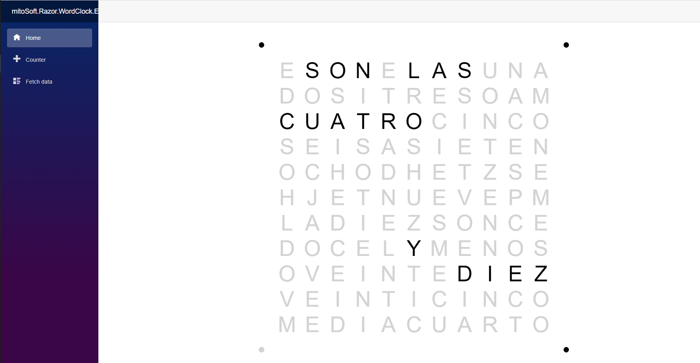

# mitoSoft.Razor.WordClock
A razor library containing a work-clock element for displaying it on Blazor websites.

Actually there are four cultures provided - english, spanish, german as well as french. 
Due to culture interfaces it is easily possible to extend the clock to every culture.

## Dependencies

 - Microsoft.AspNetCore.Components.Web (6.0.1)

## Example usage


```c#
  
  ...
  
  <mitoSoft.Razor.WordClock.View @ref="_clock" />

  @code {
    private mitoSoft.Razor.WordClock.View _clock = default!;

    protected override void OnAfterRender(bool firstRender)
    {
        if (firstRender)
        {
            this._clock.StartClock();
        }

        base.OnAfterRender(firstRender);
    }

    public void Dispose()
    {
        this._clock.StopClock();
    }
  }
	
```

A full blown usage is provided in the ExampleProject.

## Look and Feel



A german version of the Clock is shown below


The french version


The spanish version


